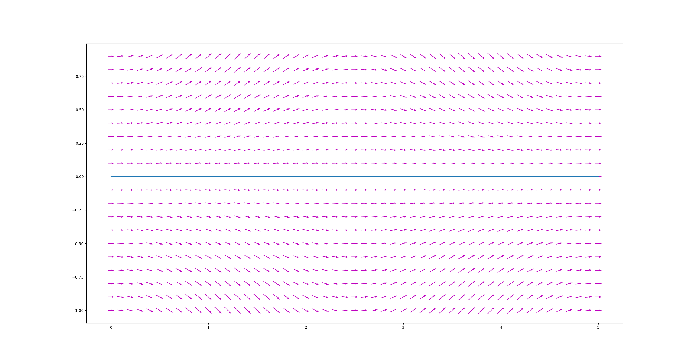

# Heuristic

A heuristic approach for simulating trains movement for noise propagation.

### Vector Field

This is an example of a calculated vector field for a given track (blue line).

---

## Installation

Download the source code an execute the setup.py file inside the main folder.

## Example

A small example on how to us this module can be found in the folder examples.